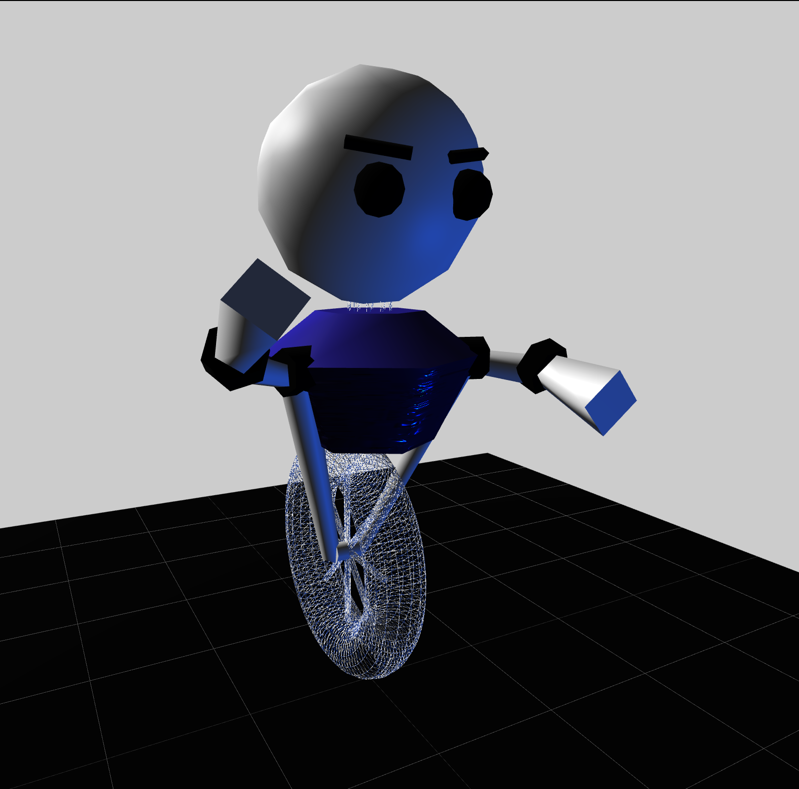

[](https://classroom.github.com/online_ide?assignment_repo_id=5769067&assignment_repo_type=AssignmentRepo)
# Object Modeling

Built an object model with three.js program in TypeScript.

## Objectives

Built a model with:

1. At least 12 parts.  
2. At least 2 different kinds of parts. 
3. At least 2 different materials. 
4. At least 3 levels of hierarchy. 
5. Use a mix of 3 basic transforms on hierarchy nodes.
6. Creativity. 

## Overview and Learning Goals

The goal of this project is to practice using a scene graph to assemble 3D scene out of 3D objects. I also learned the basics of the [three.js](https://threejs.org) graphics library. The 3D object that I created is made up of multiple pieces. I used the scene graph hierarchy and transformations (rotate, scale, translate) on the graph nodes to put together the parts to form the final object.

Here are the required elements for your main character:

The three.js sample code includes a simple camera controller so that you can rotate the scene with the mouse;  you should size you object so that it fits in the area viewed by this camera.  If you want to create an object that is bigger or smaller than the area viewed around the origin of this sample scene, simply add a node above your object's root node, and apply a scale to make your object a different size.

## Idea
Empty parent + programmable 3D shapes to enable both local and global transformations

Used normal texture 

Used GUI from 'three/examples/jsm/libs/dat.gui.module' to visulize changes

## Result
screen shot of the final result




# Compile and Run

1. cd into the directory and run ```npm install```
2. run with ```npm run dev```
3. visit ```http://localhost:3000/index.html```

## Resources

[three.js](https://threejs.org) graphics library

base code: https://github.com/cs3451-f21/a2-a-object-modeling-vsantino720 from Gatech CS3451

